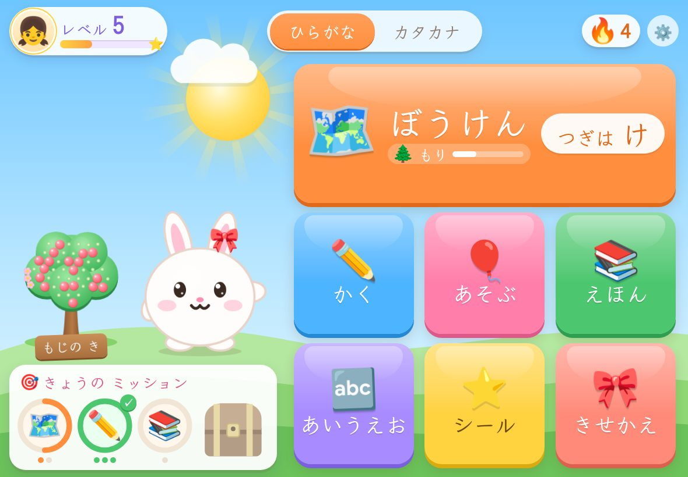
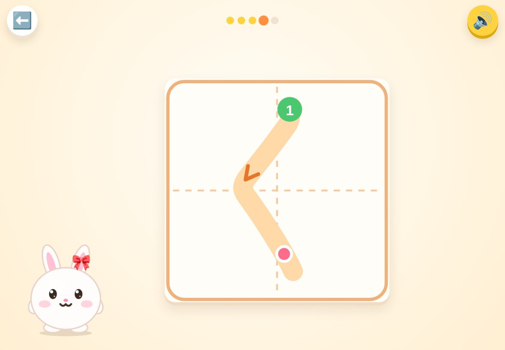
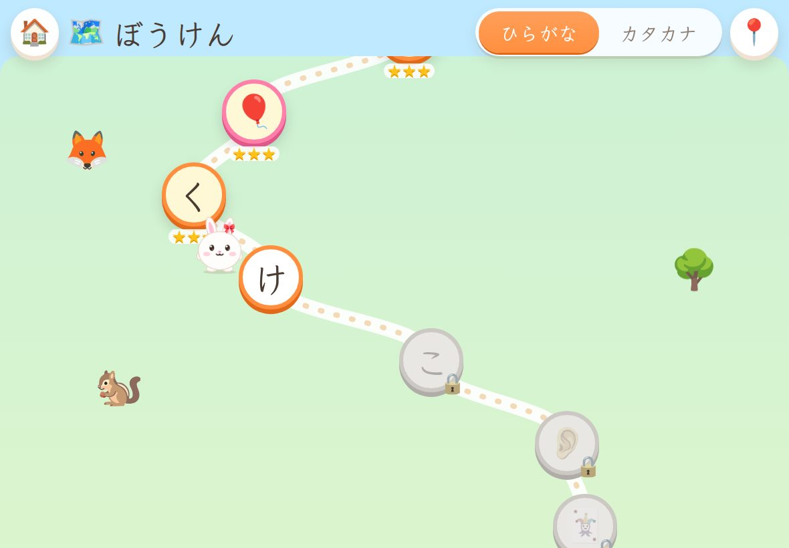
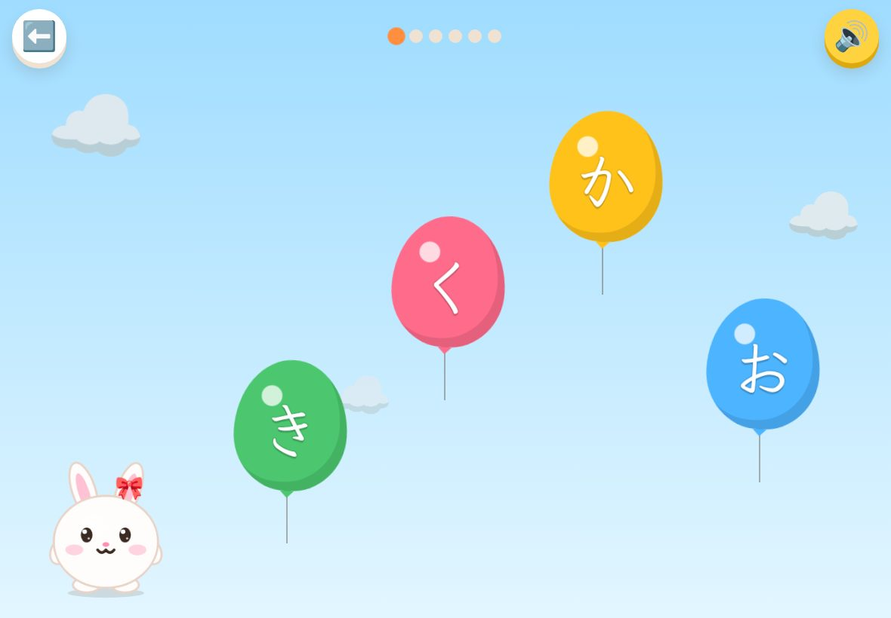
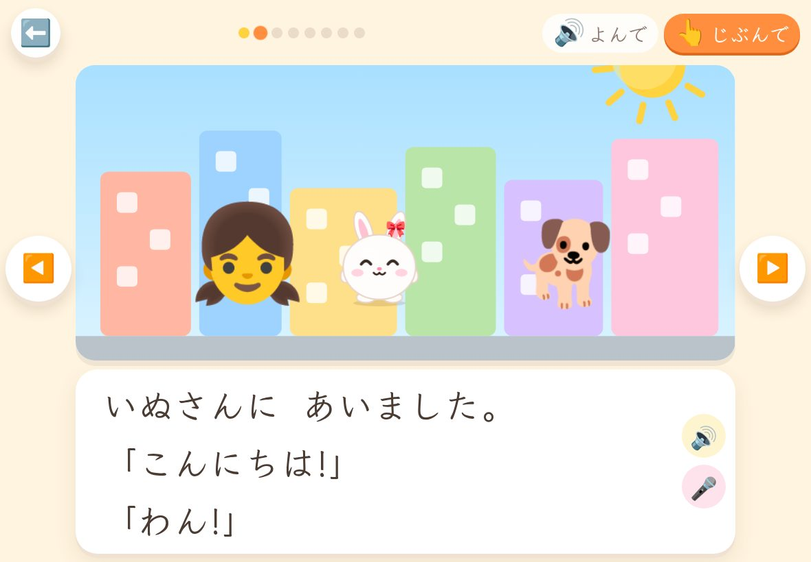

# ひらがな ぼうけん 🐰

iPad と Apple Pencil で、キャラクターといっしょに **ひらがなを「よむ」「かく」、そして絵本をひとりで読めるようになる** までを楽しく進められる学習アプリです。
3〜5歳くらいのお子さまが **ひとりで** 遊べるように、すべての文字・指示を音声で読み上げます。

- アプリの形式: Web アプリ(PWA)。iPad の Safari で開いて「ホーム画面に追加」すると、アプリのように全画面・オフラインで使えます。
- App Store や Mac は不要です。GitHub Pages で無料で公開できます。
- 記録はすべて iPad の中だけに保存され、インターネットには送信しません。



## できること

| | |
|---|---|
| 🗺️ **ぼうけんマップ** | 「はらっぱ」「もり」「うみ」…と 16 の国を旅しながら、あ行 → か行 → … → てんてん・まる → 小さい「ゃゅょっ」 → のばす音 → くっつきの「は・へ・を」まで順番に学びます(約160ステップ)。キャラクターがマップの上をぴょんぴょん進みます。 |
| 📖 **1文字レッスン** | 文字の音 → 「あり の あ」のような絵ことば → 書き順アニメ → なぞり書き → 文字さがしクイズ、の5ステップ。 |
| ✏️ **なぞり書き(Apple Pencil)** | 書き順データ(KanjiVG)を使い、1画ずつ「書き始めの位置・向き・形」を判定します。やさしい判定なので4歳でも楽しく続けられます。「なぞる / うすい / みないで」の3段階。お子さまの名前を書く練習もできます。 |
| 🎈 **ゲーム** | ふうせんわり(音を聞いて文字をタッチ) / はじめのおと(「か」から始まる絵をさがす) / ことばづくり(文字を並べて単語を作る) / よめるかな(単語を読んで絵を選ぶ) / カードめくり / しりとり |
| 📚 **絵本(13冊)** | 1語だけの絵本から短いお話まで5段階。「よんで」モードは文節ごとに色がついて読み上げ、「じぶんで」モードは読めない言葉をタッチすると読んでくれます。🎤 で自分の声を録音して聞き返すこともできます(録音は保存されません)。お子さまの名前とキャラクターがお話に登場し、覚えた文字で読める絵本には「よめる!」マークがつきます。 |
| ⭐ **ごほうび** | シール帳(はって遊べる)、キャラクターのきせかえ、毎日のスタンプカード。 |
| 👪 **おうちの方の画面** | 計算問題でロック。学習時間のグラフ、文字ごとの習熟度・苦手な文字、お子さまが書いた文字のギャラリー(成長記録)、1日の利用時間制限、読み上げの声・速さ、手書き判定のきびしさ、バックアップ/復元など。 |

学習のしくみ:

- 覚えた文字は「間隔反復(ライトナー方式)」で管理し、まちがえた文字や、しばらく出ていない文字がゲームに多めに出ます。
- 言葉のゲームは「もう習った文字だけでできた言葉」から出題されるので、習ったことがすぐに「読める」体験につながります。
- 単語カードは、ふだんひらがなで書く言葉だけを収録しています(カタカナで書く外来語は入れていません)。

<p>




</p>

## iPad で使うまでの手順

公開ページ: **https://vie324.github.io/hiragana/**

### 1. iPad のホーム画面に追加する

1. iPad の **Safari** で上の URL を開きます。
2. 共有ボタン(□に↑)→ **「ホーム画面に追加」**。
3. ホーム画面のアイコンから起動すると全画面で動き、一度開けばオフラインでも使えます。

### 2. はじめの設定

最初に「おうちの方へ」の画面が出るので、お子さまの名前(ひらがな)などを入れてから、お子さまに渡してください。
あとから変更するときは、ホーム画面右上の ⚙️ から(計算問題の答えを入力すると開きます)。

### おすすめの iPad の設定

- **読み上げの声を高品質にする**: 設定 → アクセシビリティ → 読み上げコンテンツ → 声 → 日本語 → 「Kyoko(拡張)」などをダウンロード。アプリの「おうちの方 → せってい → 読み上げ」で声を選べます。
- **アプリから出られないようにする**: 設定 → アクセシビリティ → アクセスガイド をオンにし、アプリを開いた状態でトップボタン(またはホームボタン)をトリプルクリック。
- **Apple Pencil**: ペンで書くと、手のひらが画面に触れても無視されます(指だけで書きたいときは「せってい → 書く練習 → 指での入力」を変更)。
- **消音モード**: iPad が消音(おやすみ)になっていても音が出るようにしていますが、音が出ないときは音量ボタンを確認してください。

### 公開のしくみ(アプリを更新したとき)

デフォルトブランチに push すると、GitHub Actions がテストを実行し、合格したビルドを `gh-pages` ブランチに置いて GitHub Pages で公開します(数分で反映)。
ホーム画面のアプリは、次に起動したときに新しい版に切り替わります。
リポジトリを複製して自分で公開する場合は、**Settings → Pages** で Source を「Deploy from a branch」、Branch を「gh-pages / (root)」にしてください(「GitHub Actions」を選んだ場合もそのまま公開されます)。

### データのバックアップ

記録は iPad の Safari(ホーム画面アプリ)の中に保存されます。Safari の履歴・Web サイトデータを消去すると記録も消えるので、ときどき「おうちの方 → データ → ファイルに保存」でバックアップしてください。

## 開発者向け

```bash
npm install
npm run dev        # 開発サーバー (http://localhost:5173 / 同じ Wi-Fi の iPad からも開けます)
npm test           # ユニットテスト (Vitest: 手書き判定・間隔反復・データの整合性)
npm run e2e        # E2E テスト (Playwright / iPad サイズの Chromium)
npm run build      # 型チェック + 本番ビルド (dist/)
```

- 技術: Vite + React + TypeScript。外部の実行時ライブラリは React のみで、効果音・BGM は Web Audio API、読み上げは Web Speech API で生成しています(音声ファイルなし)。
- iPad 実機でのテスト: `npm run dev` を実行し、iPad の Safari で `http://<PCのIPアドレス>:5173` を開きます(読み上げ・Apple Pencil の確認はこれが確実です)。

主なファイル:

| パス | 内容 |
|---|---|
| `src/data/curriculum.ts` | ぼうけんマップのステージとノード |
| `src/data/words.ts` | 単語カード(ひらがな・絵文字・読み上げ用の漢字) |
| `src/data/books.ts` | 絵本(文節ごとにスペース、`{name}` でお子さまの名前) |
| `src/data/specialLessons.ts` | てんてん・小さい文字・助詞のレッスン |
| `src/lib/stroke.ts` | 手書き判定(SVG パスの折れ線化・DTW による比較) |
| `src/lib/srs.ts` | 間隔反復(覚えぐあいの管理) |
| `src/lib/speech.ts` / `sound.ts` | 読み上げ(iPad Safari 対策込み)/ 効果音・BGM |
| `src/components/WritingPad.tsx` | Apple Pencil 対応のなぞり書きパッド |
| `scripts/build-strokes.mjs` | KanjiVG から書き順データを再生成 |
| `scripts/make-icons.mjs` | アプリアイコンの PNG を生成 |

絵本を追加するときは `src/data/books.ts` の `BOOKS` に追記するだけで本棚に並びます(`npm test` で使える文字などをチェックします)。

## クレジット・ライセンス

- 書き順データ(`src/data/strokes.json`)は [KanjiVG](https://kanjivg.tagaini.net)(© Ulrich Apel)をもとに生成しています。ライセンスは [CC BY-SA 3.0](https://creativecommons.org/licenses/by-sa/3.0/) です。
- フォントは [Klee One](https://fonts.google.com/specimen/Klee+One)(© The Klee Project Authors / Fontworks)をひらがな・カタカナ部分だけに縮小して同梱しています。ライセンスは [SIL Open Font License 1.1](src/assets/fonts/KleeOne-OFL.txt) です。
- 絵には各端末の絵文字(iPad では Apple の絵文字)を使っています。
- 絵本のお話とキャラクターはこのアプリのオリジナルです(「おむすびころりん」「おおきなかぶ」は昔話をもとにした書き下ろしです)。

詳しくは [THIRD_PARTY_NOTICES.md](THIRD_PARTY_NOTICES.md) を参照してください。
